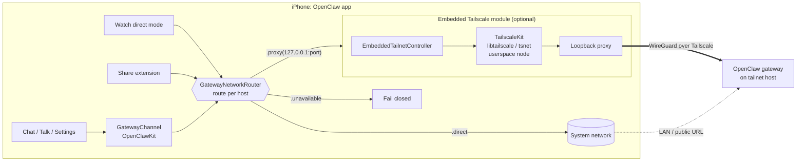
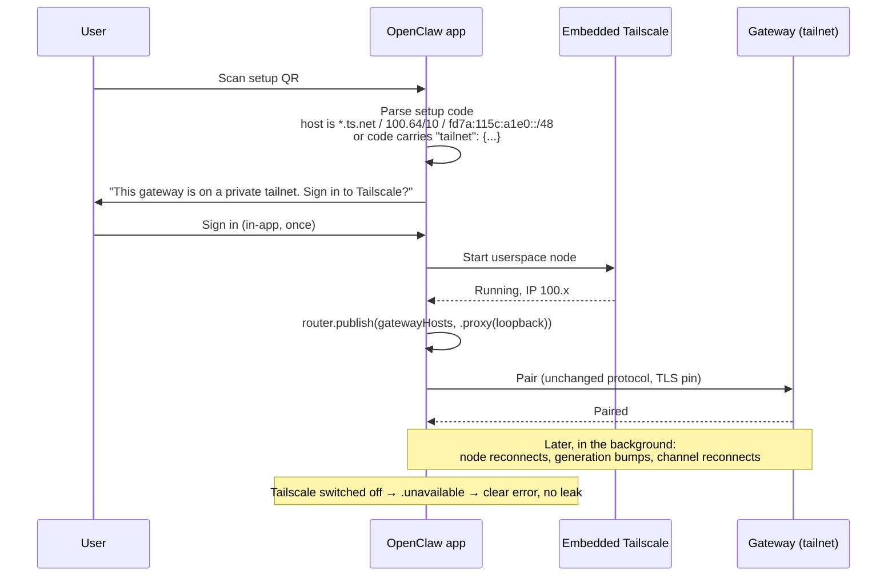

# OpenClaw Tailnet: embedded private networking for OpenClaw mobile apps

This is an OpenClaw fork that lets the iOS app reach a private gateway through a **Tailscale node that runs inside the app**, with no Tailscale app, no system VPN and no public exposure. It is built on unmodified upstream OpenClaw. The fork adds one small routing seam to the shared kit and one optional transport module.

This is a reference implementation and proposal. The goal is to upstream it. See [Upstream plan](#upstream-plan).

---

## 1. Why

A personal agent runs on a machine you control, such as a Mac, home server or VM. Your phone needs to reach it from anywhere, privately. Today's options are all compromises:

| Option                               | Problem                                                                         |
| ------------------------------------ | ------------------------------------------------------------------------------- |
| Public URL or tunnel (Funnel, ngrok) | The gateway is exposed to the internet                                          |
| Separate Tailscale/VPN app           | Extra install; the VPN drops in the background; onboarding fails when it is off |
| LAN only                             | Doesn't work away from home                                                     |

More personal agents appear every month, and they all hit the same problem. This fork solves it once, at the transport layer, without touching the agent protocol.

---

## 2. Architecture



### Layers

| Layer                                       | Owner                     | Change                                     |
| ------------------------------------------- | ------------------------- | ------------------------------------------ |
| Agent protocol, pairing auth, TLS pinning   | OpenClaw core             | **None**                                   |
| `GatewayNetworkRouter` (routing seam)       | `apps/shared/OpenClawKit` | **New, ~150 lines.** Defaults to `.direct` |
| Call sites (`GatewayChannel`, Watch, Share) | OpenClawKit / iOS         | One `router.apply(...)` each               |
| Setup code `tailnet` block                  | OpenClawKit               | Optional field, backward-compatible        |
| Embedded Tailscale transport                | `apps/ios` module         | **New, optional**                          |

### The seam

```swift
public enum GatewayNetworkRoute: Sendable, Equatable {
    case direct                          // today's behaviour, the default
    case proxy(GatewayProxyEndpoint)     // transport exposes a local proxy
    case unavailable                     // fail closed: never fall back to public
}

public final class GatewayNetworkRouter {
    public static let shared: GatewayNetworkRouter
    public func publish(hosts: some Sequence<String>, route: GatewayNetworkRoute)
    public func route(forHost host: String?) -> GatewayNetworkRoute
    public func apply(to: URLSessionConfiguration, forHost: String?) -> GatewayNetworkRoute
    public func apply(to: NWParameters, forHost: String?) -> GatewayNetworkRoute
}
```

**Contract**

- Transports **publish** routes for the hosts they own. Consumers **ask** the router when they create a session.
- No transport registered means every host is `.direct`, which is byte-for-byte today's behaviour.
- `.unavailable` routes to a blackhole proxy, so a gateway that should be private never leaks to the public path while the node is down.
- A generation counter lets consumers detect route changes and reconnect.
- Nothing is Tailscale-specific. Iroh (#94695), WireGuard or a corporate proxy can plug in the same way.

---

## 3. User flow



### Setup code extension (optional, backward-compatible)

```json
{
  "url": "wss://gateway.example.ts.net",
  "bootstrapToken": "…",
  "tailnet": { "required": true, "hostname": "family-phone" }
}
```

Older gateways that issue codes without `tailnet` still work. The app infers it from a tailnet-only host.

### States shown to the user

| State                       | Meaning                  | Route                                          |
| --------------------------- | ------------------------ | ---------------------------------------------- |
| Off                         | User disabled Tailscale  | `.direct`; tailnet hosts become `.unavailable` |
| Needs sign-in               | Node has no identity yet | `.unavailable`                                 |
| Starting                    | Node coming up           | `.unavailable`                                 |
| Connected (100.x)           | Node running             | `.proxy`                                       |
| Gateway not on your tailnet | Name or ACL mismatch     | `.unavailable` with an actionable error        |

---

## 4. Security properties

- **No public exposure:** the gateway stays on the tailnet, with no Funnel or port-forward.
- **Fail closed:** a tailnet-only gateway is never contacted over the public network.
- **Unchanged auth:** OpenClaw pairing tokens and TLS pinning apply on top of WireGuard. Tailscale is transport only.
- **No embedded keys:** the node signs in interactively, and there are no auth keys in the app or in setup codes.
- **Pinned dependency:** TailscaleKit is built from a pinned `tailscale/libtailscale` commit (BSD-3-Clause; licence shipped in `Resources/Licenses`).

---

## 5. Build

```bash
cd apps/ios
scripts/tailscalekit-build.sh        # builds pinned TailscaleKit.xcframework (needs Go)
xcodegen generate
xcodebuild -scheme OpenClaw -destination 'platform=iOS Simulator,name=iPhone 17' build
```

Builds without the module: remove the `TailscaleKit` framework dependency. The router stays and defaults to `.direct`.

---

## 6. What is and isn't in this fork

| In                                                        | Out (deliberately)                         |
| --------------------------------------------------------- | ------------------------------------------ |
| Routing seam + call sites                                 | UI redesign experiments                    |
| Setup-code `tailnet` block + inference                    | Private TestFlight/fastlane lanes, signing |
| iOS embedded Tailscale transport, toggle, sign-in, errors | Anything specific to one person's tailnet  |
| Watch/Share direct-mode ordering fixes                    |                                            |
| Unit + UI tests (synthetic fixtures only)                 |                                            |

---

## 7. Android (planned)

The same contract applies. Tailscale's `libtailscale` supports Android, and the router maps to an OkHttp `Proxy`/`ProxySelector`. It is not built yet. We are waiting for agreement on the seam so it is built once, to the same contract. Related: #142529.

---

## Upstream plan

1. **Feature request** on openclaw/openclaw: problem, this design and alternatives, following CONTRIBUTING (issue first).
2. **Draft PR 1:** the `GatewayNetworkRouter` and call sites only. All `.direct`, so there is no behaviour change.
3. **PR 2:** setup-code `tailnet` block and tests.
4. **PR 3:** iOS embedded Tailscale module.
5. **PR 4:** Watch/Share ordering fixes.
6. **PR 5:** Android transport.

If maintainers prefer the plugin route, the module ships as a third-party package against the same seam.

## Related issues

#138430 · #153903 · #142529 · #98062 · #94695

## Licence

MIT, the same as OpenClaw. The TailscaleKit/libtailscale portion is BSD-3-Clause © Tailscale Inc. & AUTHORS.
